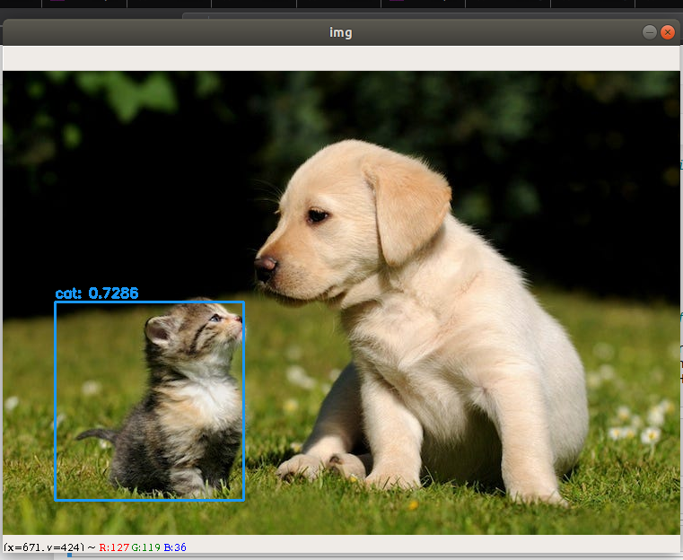

<h1 align="center"> caMicroscope_code_challenge </h1>
This repository is an approach to solve the challenge of Cancer Region Of Interest extraction from the image which deals with detection of Cancer from Specific area.

Being a coding challenge the main aim is to create a solution for creation of ROI after detection of seperate object in an image. 


As a part of this coding challenge I have used YOLO object detection to detect certain object such as **Cat** in the given image and after detection of the cat creation of certain bounding box where actually cat is there this is done by YOLO algorithm which generally means You Look Only Once.

In this algorithm only once an images is transmitted to the model and model after creation many bounding box around certain object generates the most appropriate results which specify the actual position with max bounding box coverages to determine the actual position of the object.

Weights file can be downloaded using :- 

```wget https://pjreddie.com/media/files/darknet19.weights```


Before Object detection,

</img>

After Object Detection,

</img>

Hence, Object Detection using OpenCV and YOLO weights parameters can be done and visualized in order to get the more accurate results.

Similarly, to generalize my model the general approach of mine to identify the regions of cancer is to create a Mask RCNN which involves masking out those areas of Interest which have the cancer cells chances so as to improve the results using the pretrained model and using various transfer learning techniques to reciprocate that model to perform prediction on new images so visualize more accurate results.
